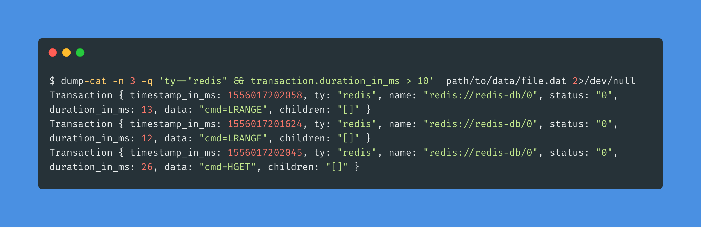

# Dump-cat [](https://travis-ci.com/gfreezy/dump-cat)
Dump-cat is a tool for dumping [cat](https://github.com/dianping/cat) logviews.

## Installation

```bash
git clone https://github.com/gfreezy/dump-cat.git
cd dump-cat
cargo build --release
```

## Usage

```
dump-cat 0.1.1
gfreezy <gfreezy@gmail.com>
Dump cat logviews.

USAGE:
    dump-cat [FLAGS] [OPTIONS] <path>

FLAGS:
    -h, --help       Prints help information
        --json       output as json
    -V, --version    Prints version information

OPTIONS:
    -n, --number <num>     
    -q, --query <query>    variables:
                           [status|ty|name|timestamp_in_ms|transaction.duration_in_ms|transaction.duration_start]

ARGS:
    <path>    Input file

```


## License

Licensed under either of

 * Apache License, Version 2.0
   ([LICENSE-APACHE](LICENSE-APACHE) or http://www.apache.org/licenses/LICENSE-2.0)
 * MIT license
   ([LICENSE-MIT](LICENSE-MIT) or http://opensource.org/licenses/MIT)

at your option.

## Contribution

Unless you explicitly state otherwise, any contribution intentionally submitted
for inclusion in the work by you, as defined in the Apache-2.0 license, shall be
dual licensed as above, without any additional terms or conditions.
